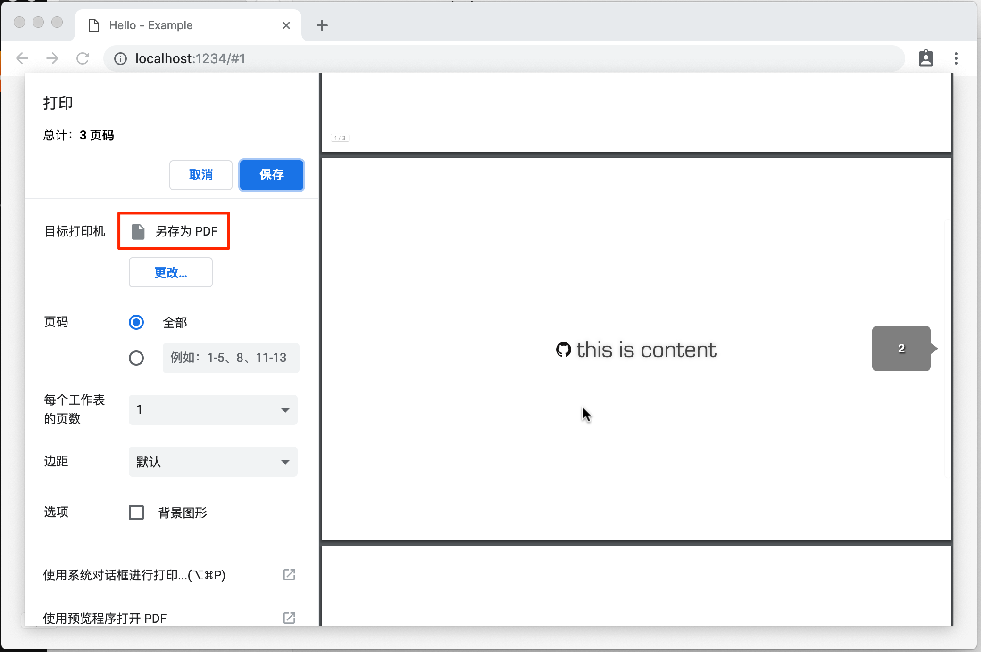

# vue-mark-display

A Vue Component to generate Markdown-based slides.

## Installation

```bash
npm install vue-mark-display
```

## Usage

```vue
<template>
  <mark-display
    :markdown="markdown"
    @title="setTitle"
    keyboard-ctrl
    url-hash-ctrl
    auto-font-size
    auto-blank-target
  ></mark-display>
</template>

<script>
import MarkDisplay from "vue-mark-display";

const markdown = `# Hello World
----
This is Vue Mark Display`;

export default {
  components: { MarkDisplay },
  data() {
    return { markdown };
  },
  methods: {
    setTitle({ title }) {
      document.title = title;
    }
  }
};
</script>

<style>
body {
  margin: 0;
  overflow: hidden;
}
</style>
```

## The Extension for Markdown Syntax

1. It's based on [marked](https://www.npmjs.com/package/marked).
2. You can separate pages by horizon lines (`----`).
3. You can use HTML comments for meta info of each slides. The format is like `<!-- key: value -->`. Here are all useful meta keys below:
   - `background`: the background style of the slide
   - `backgroundColor`: the background color of the slide
   - `backgroundImage`: URL of the background image of the slide
   - `color`: the default font color of the slide
   - `style`: inline css text attached to the slide
   - `stageBackground`: the background style attached to the stage when the current slide is shown

Example:

```markdown
<!-- color: red; -->
<!-- style: font-weight: bold; -->

# Hello

---

<!-- stageBackground: silver -->

![./favicon.ico] this is content
```

## API

### Default Export: the Component

#### Props

```js
{
  // markdown content
  markdown: String,
  // or give a markdown URL
  src: String,
  // initial page number
  page: Number,
  // set `baseUrl` for the whole document
  // so all the relative URLs in markdown content would be applied
  baseUrl: String,
  // whether use `src` as the `baseUrl` automatically
  autoBaseUrl: Boolean,
  // whether open links in a blank target by default
  autoBlankTarget: Boolean,
  // whether adjust font-size to adapt the screen size
  autoFontSize: Boolean,
  // whether support keyboard shortcuts (Arrows, Enter, Ctrl+G)
  keyboardCtrl: Boolean,
  // whether update URL hash when page changed
  urlHashCtrl: Boolean,
  // support opening an iframe on top of the page to preview a URL
  // when click the `<a>` link with `altKey` pressed
  supportPreview: Boolean
}
```

#### Events

- `@change="func({ from, to })"`: when page changed
- `@title="func({ title })"`: when title changed

#### Styles

The root element of the `<mark-display>` component has a class named `mark-display` which you can use for styling.

Also you can overwite the default transition style below on each slides:

```css
.slide {
  position: absolute;
  top: 0;
  left: 0;
  width: 100vw;
  height: 100vh;
  transition: all 0.3s;
}
.slide-enter {
  opacity: 0;
}
.slide-leave-to {
  opacity: 0;
}
```

To learn more about transitions on Vue, see [here](https://vuejs.org/v2/guide/transitions.html).

At the end, it's a good choice to "normalizing" the body **by your own**:

```css
body {
  margin: 0;
  overflow: hidden;
}
```

And feel free to set other styles for common HTML tags as you like.

If you want to customize other styles in the component, please be careful. Because they are not guaranteed which means they may be changed in the future.

#### Methods

With these methods you can call them outside through its [`ref`](https://vuejs.org/v2/api/#ref). For example on the bottom you can use them to support touchable screens.

- `goto(page: number)`: go to a given page which is counted from `1` (not `0`)
- `goNext()`: go to next page if possible
- `goPrev()`: go to previous page if possible
- `goFirst()`: go to the first page
- `goLast()`: go to the last page

### Named Export: `setHighlighter()`

Set a centralized code highlighter.

- **parameters:**
  - `highlighter: function (code: string, lang: string): string`: the customized code highlighter from you
- **examples:**

  Take [highlight.js](https://highlightjs.org) for example:

  ```js
  import hljs from "highlight.js";
  import "highlight.js/styles/github.css";
  import { setHighlighter } from "vue-mark-display";
  setHighlighter(code => hljs.highlightAuto(code).value);
  ```

## For Touchable Screen

You can using some open source touch event libs to bring touch controls into the slides. For example the code below is using [Hammer.js](http://hammerjs.github.io) and methods `goNext()`/`goPrev()` to support `swipe` gestures:

```html
<template>
  <mark-display ref="main" markdown="..." />
</template>

<script>
import Hammer from "hammerjs";
import MarkDisplay from "vue-mark-display";
export default {
  components: { MarkDisplay },
  mounted() {
    const mc = new Hammer(this.$el);
    const main = this.$refs.main;
    mc.on("swipe", event => {
      if (event.pointerType === "mouse") {
        return;
      }
      switch (event.direction) {
        case Hammer.DIRECTION_LEFT:
          main.goNext();
          return;
        case Hammer.DIRECTION_RIGHT:
          main.goPrev();
          return;
      }
    });
  }
};
</script>
```

## Export into PDF



You can print the slides simply by <kbd>CMD</kbd>+<kbd>P</kbd>. The page style has been automatically formated by [CSS page media](https://drafts.csswg.org/css-page/) & [fragmentation](https://drafts.csswg.org/css-break/) specs under the hook. Then just select "export to PDF" on the print dialog to finish it. That makes your slides easy to export and share on/off the internet.

_Notice that when you print the slides, only current screen-displayed `stageBackground` meta info is active. So it would be applied to all pages of the exported PDF._
